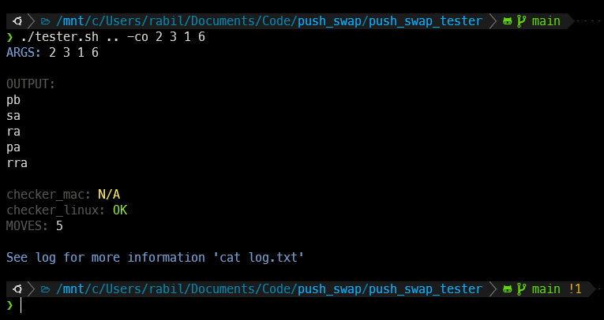
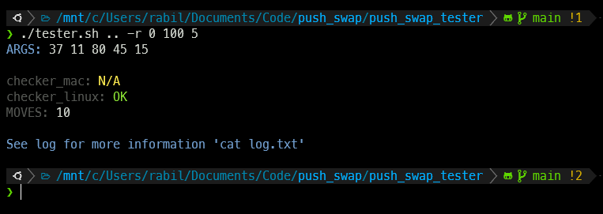
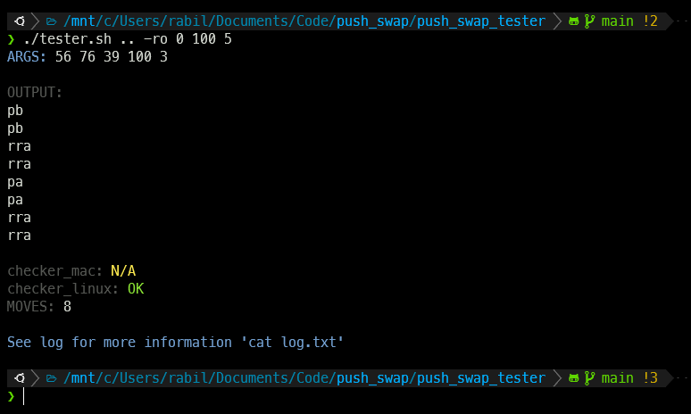
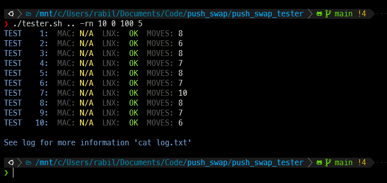
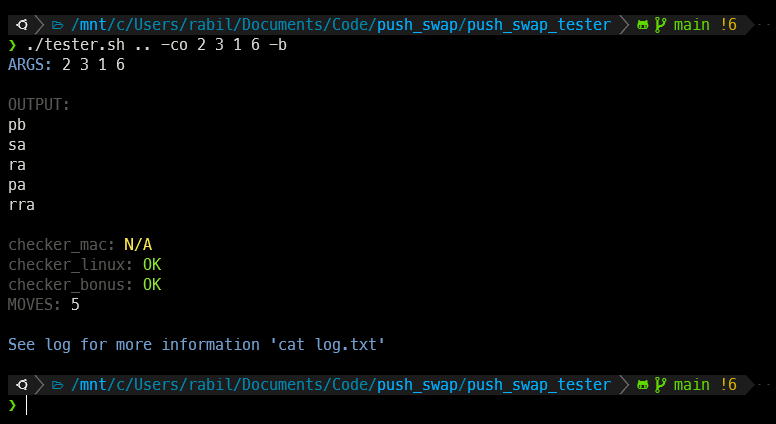
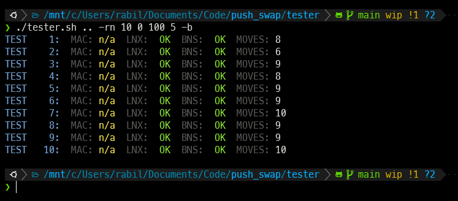

# 42 push_swap tester

## Info

A tester for 42 push_swap.

Works on Mac and Linux.

For `zsh`, not tested in `bash`.

## How to use

- Clone the repository

```sh
git clone https://github.com/izenynn/push_swap_tester.git
```

- Give `./tester.sh` execute permissions

```sh
chmod +x ./tester.sh
```

- Give checkers execute permissions

```sh
chmod +x ./checkers/*
```

- Run `./tester.sh` with `--help` flag to learn how to use it

```sh
./tester.sh --help
```

```
Usage: ./tester.sh [PUSH_SWAP PATH] [OPTION] [ARGUMENTS]...
A tester for 42 push_swap project
It saves output and more info in a generated file called 'log.txt'
Example: ./tester.sh -r -10 10

Options:

    -c [ARGUMENTS]...
            run push_swap with provided arguments
    -co [ARGUMENTS]...
            like -c but displays your push_swap output
    -r [RANGE START] [RANGE END] [QUANTITY]
            generate a list of random numbers between range
            start and range end. If a quantity is specified
            it will choose that amount of numbers from the
            generated list (default is all the list)
    -ro [RANGE START] [RANGE END] [QUANTITY]
            like -r but displays your push_swap output
    -rn [NUMBER OF TESTS] [RANGE START] [RANGE END] [QUANTITY]
            like -r but it will perform the number of test
            you specified

In addition, you can add the flag "-b" at the end of any
command to display also the checker_bonus output
Example: ./tester.sh -rn 100 0 5 -b

Also note that in -r, -ro and -rn if range end is smaller than range
start range will be 0, so no random arguments will be generated.
Example: ./tester.sh 10 5 (no numbers will be generated becouse end
is smaller than start)

Also note that if quantity is less than range, then quantity will
be equal to range.
Example: ./tester.sh 0 3 5 (quantity will be 3, not 5)

NOTE: if checker is not working, make sure the checker file has the
proper permissions.
Example: chmod +x checkers/*

Tester by: izenynn
github: https://github.com/izenynn
```

- ✨ Magic ✨

## Screenshots

### flag `-c`


### flag `-co`



### flag `-r`



### flag `-ro`



### flag `-rn`



### use checker_bonus `-b`





##

[](https://forthebadge.com)
[](https://forthebadge.com)
